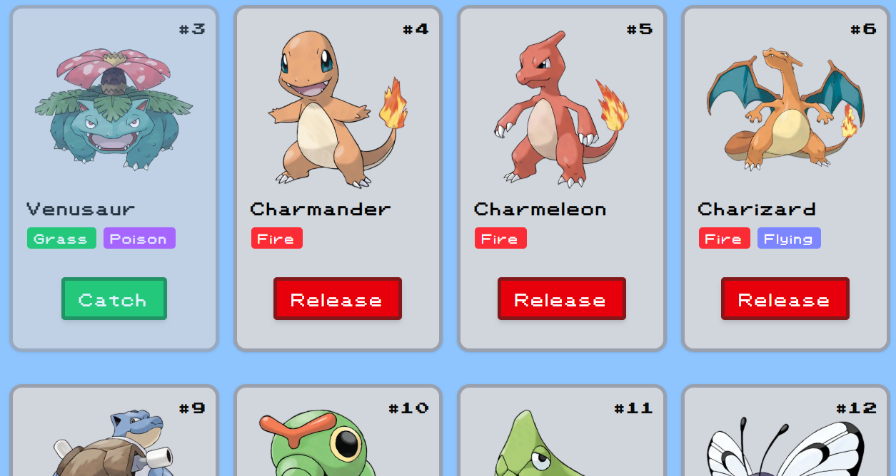
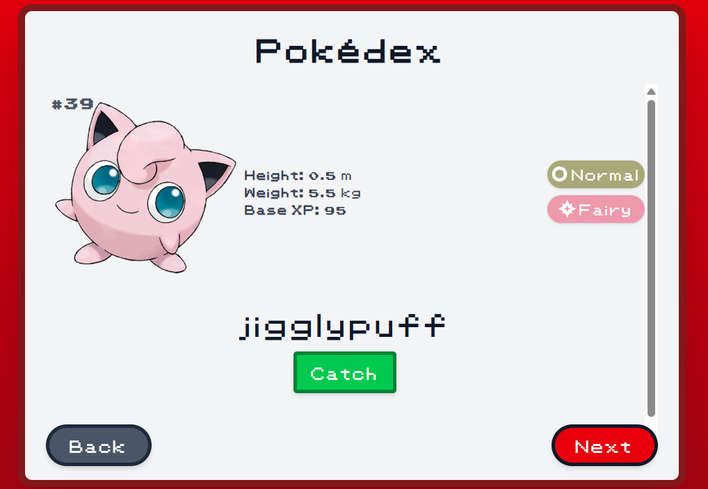
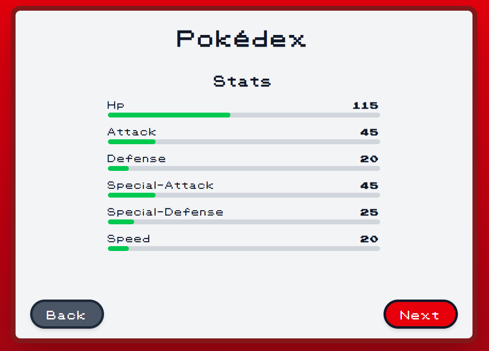
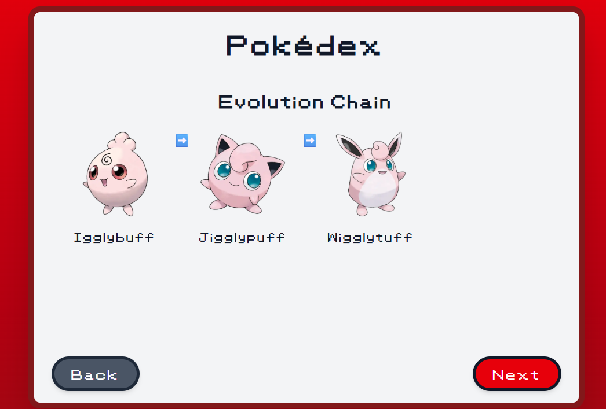
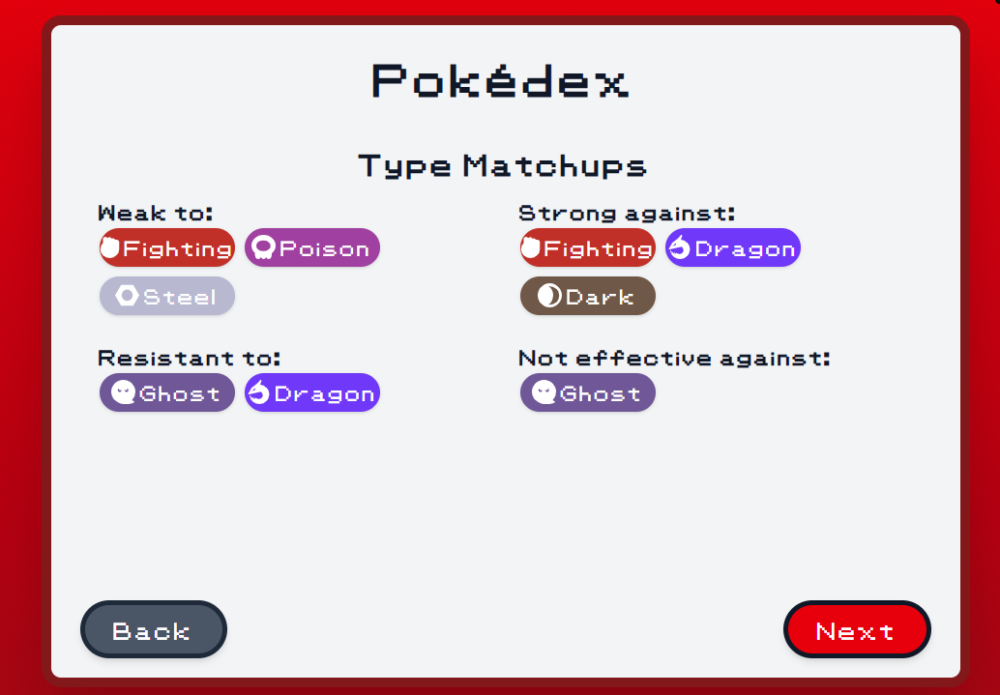
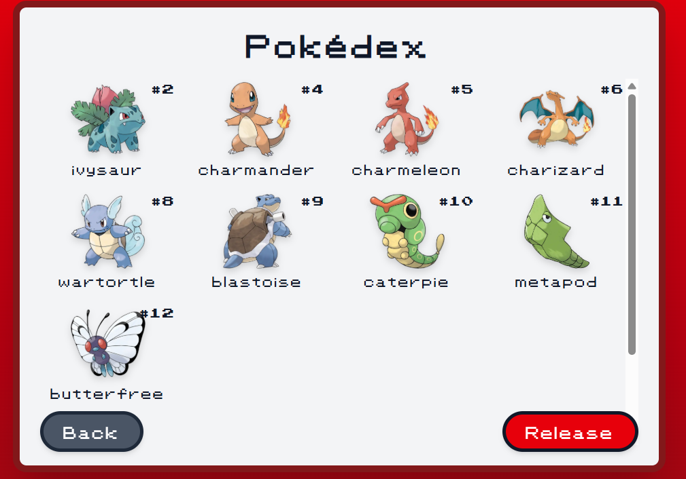
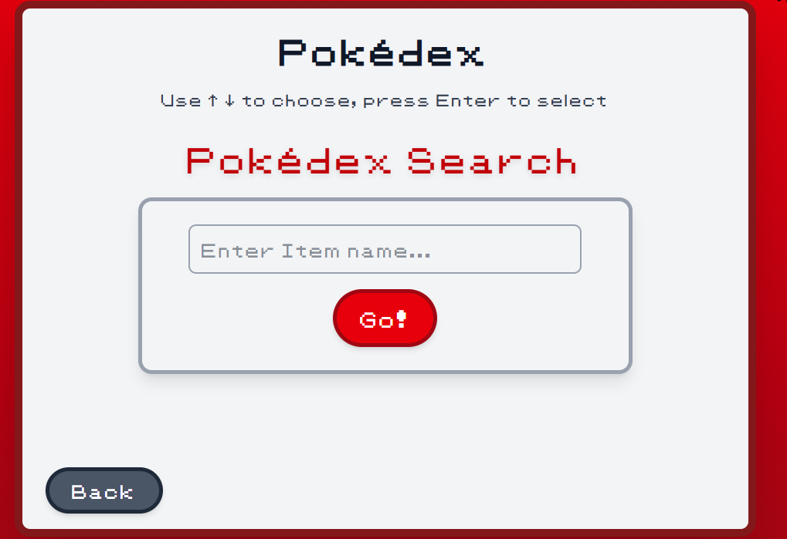

# 🎮 Pokédex App

A modern **full-stack Pokémon web application** built with **Next.js 15, TypeScript, Tailwind CSS, and MongoDB**.  
The app lets users explore and search Pokémon, catch and release them into their personal Pokédex, and discover types, evolutions, and items — all in a clean, responsive, and animated UI.


---

## 🚀 Features

### 🔎 Pokémon Explorer

-   Browse through all Pokémon (1–1010) with **infinite scroll**
-   Detailed Pokémon pages with stats, sprites, type effectiveness, and evolutions

### 📖 Personal Pokédex

-   **Catch and release Pokémon** to build your own collection
-   Synced to user accounts via **NextAuth authentication**

### 🔍 Search System

-   Search Pokémon by **name or ID**
-   Search **Items** and **Types** with infinite scroll and detail pages

### ⚔️ Type Effectiveness

-   View type matchups (**weaknesses, resistances, strengths**)
-   Dynamic, color-coded type badges

### 🎒 Items & Effects

-   Explore Pokémon items with sprites, effect descriptions, and flavor texts

### ✨ Modern UI/UX

-   Fully responsive **mobile-first design**
-   Smooth animations with **Framer Motion**
-   Custom design system with **Shadcn UI**

---

## 🖼️ Screenshots

### Home Page / Pokédex Grid



### Pokémon Detail Page






### Personal Pokédex



### Item Search



---

## 🛠️ Tech Stack

**Frontend**

-   Next.js 15 (App Router, Server Actions, Server/Client Components)
-   React 19 + TypeScript
-   Tailwind CSS + custom design system
-   Framer Motion for animations
-   Shadcn UI for UI primitives

**Backend**

-   MongoDB with Mongoose models
-   NextAuth.js for authentication
-   PokeAPI as data source (seeded into local DB)

**Deployment**

-   Vercel for frontend hosting
-   MongoDB Atlas / custom DB deployment

---

## 📦 Installation & Setup

```bash
# 1. Clone the repository
git clone https://github.com/yourusername/pokedex.git
cd pokedex

# 2. Install dependencies
npm install
```
